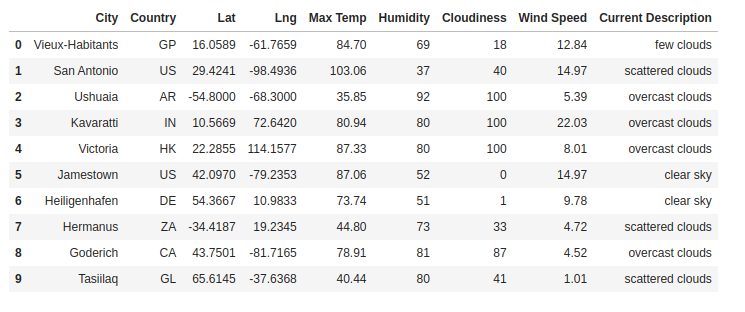
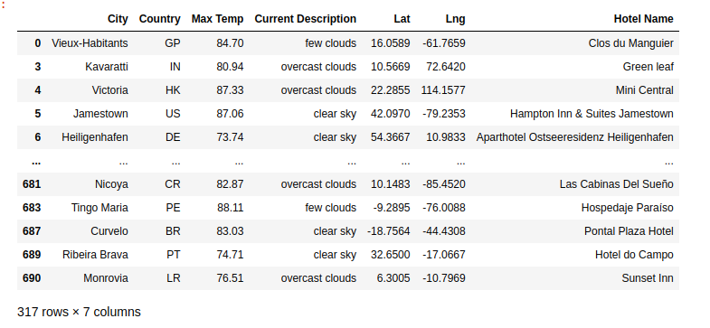
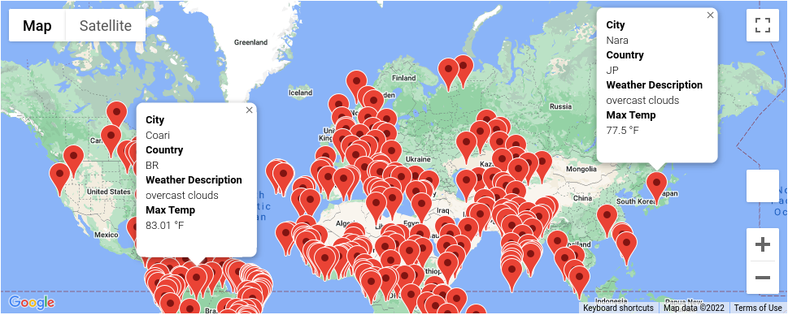
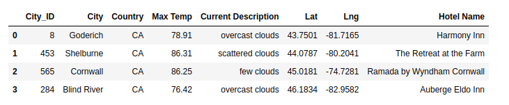
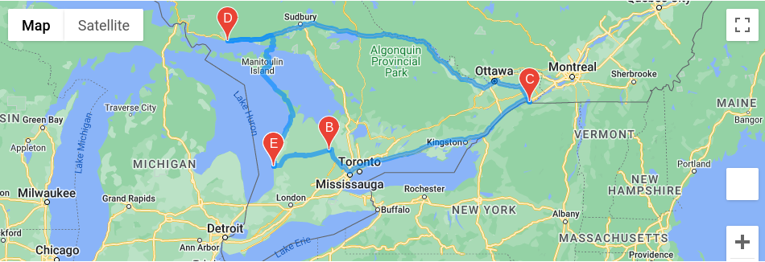
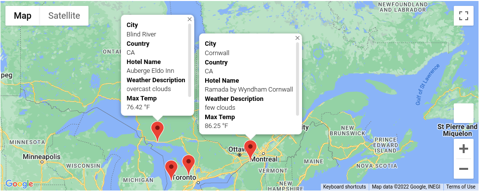

# World_Weather_Analysis
Using APIs to Visualize Weather Data

## Background
Collect and analyze weather data across cities worldwide.

## Overview of Project 
Create a Pandas DataFrame with 500 or more of the world's unique cities and their weather data in real time. This process will entail collecting, analyzing, and visualizing the data.

### Purpose

The client (PlanMyTrip) will use the data to recommend ideal hotels based on clients' weather preferences.

### Analysis of Outcomes

 

We were able to create a DataFrame with a list of random latitudes and longitudes, then using Pandas citypy module we found and matched random cities around the world. Finally we used OpenWeatherMap API to retrieve the current weather conditions for each random location. All this data was put together in a single DataFrame as shown in Figure 1.1.

Figure 1.1 Weather per city DataFrame

 

Then using the weather_DataFrame and Google Maps and Places API, we created a hotel_ DataFrame that included hotels in a specific range of weather selections depending in the client inputs. (Figure 1.2)

Figure 1.2 Hotels per city DataFrame

 

Utilizing the hotel_DataFrame and google maps API, we generate a map with hotel markers and information cards about the location and wetaher conditions. (Figure 1.3)

Figure 1.3 Map with hotels marker

 

In order to provide our client (PlanMyTrip) with a better tool for their customers, we created a tool that based on the users input generated a vacation itinerary (Figure 1.4)

Figure 1.4 Vacation Itinerary

 

Also generated a map with driving directions and the stops per the itinerary (Figure 1.5)

Figure 1.5 Vacation map with driving directions

 

and a map that included the vacation stop's per the itinerary and  information cards about the location, weather and hotel info. (Figure 1.6)

Figure 1.6 Vacation map with markers

 

## Summary

In this project we utilized python, pandas libraries and APIs to create a comprehensive tool that our clients can use to provide a better experience to their customers. With some inputs about weather preferences from the customers, the tool will produce a list of hotels in locations that match the customers weather preferences. It will generate a series of maps with location, and weather information. 

Also provides an interface for the customers to plan their vacations, with the customers input on the vacations stop's, the tool will generate an itinerary with each stop's information. Then it generates a series of maps with driving directions and info cards about each location's weather and hotels. 
 

 

## References
[Markdown](https://docs.github.com/en/get-started/writing-on-github/getting-started-with-writing-and-formatting-on-github/basic-writing-and-formatting-syntax)

[Matplotlib gallery](https://matplotlib.org/stable/plot_types/stats/pie.html#sphx-glr-plot-types-stats-pie-py)
